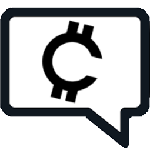
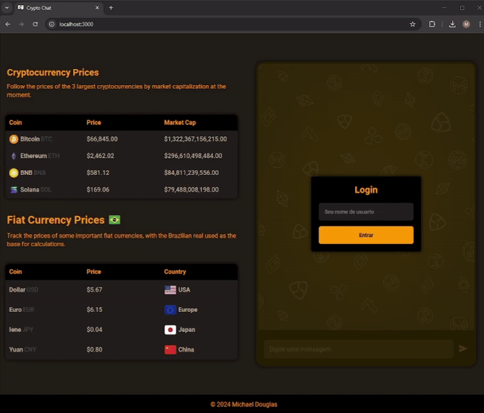

<h1 align="center"> Crypto Chat </h1>

<p align="center">
  Personal project to apply my studies on websockets. In this project, you can easily track the prices of various cryptocurrencies and major fiat currencies while chatting with others who share similar interests. Join us to learn, connect, and share your passion for the crypto world!
</p>

<p align="center">
  
  
</p>

## Technologies

<table border="0">
  <tr>
    <td>
      <a href="https://nodejs.org/en" target="_blank">
        
      </a>
    </td>
    <td style="border:none"><a href="https://nodejs.org/en" target="_blank">Node.js</a></td>
  </tr>
  <tr>
  <td>
    <a href="https://developer.mozilla.org/en-US/docs/Web/HTML" target="_blank">
      
    </a>
  </td>
  <td><a href="https://developer.mozilla.org/en-US/docs/Web/HTML" target="_blank">HTML</a></td>
</tr>
<tr>
  <td>
    <a href="https://developer.mozilla.org/en-US/docs/Web/CSS" target="_blank">
      
    </a>
  </td>
  <td><a href="https://developer.mozilla.org/en-US/docs/Web/CSS" target="_blank">CSS</a></td>
</tr>
  <tr>
    <td>
      <a href="https://expressjs.com/pt-br/" target="_blank">
        
      </a>
    </td>
    <td><a href="https://expressjs.com/pt-br/" target="_blank">Express</a></td>
  </tr>
  <tr>
    <td>
      <a href="https://socket.io/docs/v4/" target="_blank"  style="width:47px;">
        
      </a>
    </td>
    <td><a href="https://socket.io/docs/v4/" target="_blank">Socket.io</a></td>
  </tr>
</table>

## Prerequisites

> [!WARNING]
> To run the project, you must install the following tools on your machine:

- [Node.js](https://nodejs.org/en): v18 or higher.

The project uses two APIs to obtain the current exchange rate, you can create a free account on the page of both APIs:

- [CoinGecko](https://docs.coingecko.com/reference/introduction): The CoinGecko API is necessary to obtain information about crypto assets.
- [ExchangeRate-API](https://www.exchangerate-api.com/docs/overview): The ExchangeRate-API is required to obtain information about fiat currencies.

[!IMPORTANT] Rename the .env_example into .env and change the EXCHANGE_RATE_KEY field.

```
PORT= //port to the server
COINGECKO_URL=https://api.coingecko.com/api/v3 //coingecko base url
EXCHANGE_RATE_API=https://v6.exchangerate-api.com/v6 //exchange rate api base url
EXCHANGE_RATE_KEY= //exchange rate api key
```

## Installation

Clone the repository to your computer

```
git clone https://github.com/MichaelDouglasPIX/crypto-chat.git
```

Access the project

```
cd crypto-chat
```

Install dependencies

```
npm i
```

## Run project locally

Start the project

```
npm run dev
```

### Web page

After executing the project, it is possible to view the page with the chat and currency quotes.

- Visit `http://localhost:3000/` if the port in .env has been changed, access localhost with the new port.

## License

[MIT licensed](LICENSE).
